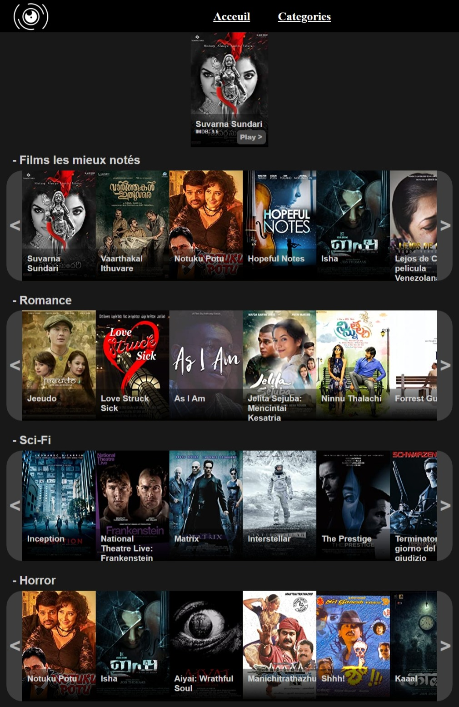

# JustStreamIt

Site permettant de visualiser les films les mieux notés de la base de donnée [OC-Movies-Database](https://github.com/OpenClassrooms-Student-Center/OCMovies-API-EN-FR.git) par categories.



## Description

Ce projet est une interface permettant d'afficher de facons simple les elements fournis par l'API de l'[OC-Movies-Database](https://github.com/OpenClassrooms-Student-Center/OCMovies-API-EN-FR.git) en faisant appel à l'API [fetch](https://developer.mozilla.org/docs/Web/API/Fetch_API) de facon asynchrone.

## Utilisation

1. Cloner et lancer le serveur API [OC-Movies-Database](https://github.com/OpenClassrooms-Student-Center/OCMovies-API-EN-FR.git)
2. Dans le repertoire public/ lancer un serveur HTTP
    ```shell
    > python3 -m http.server 8080
    ```
3. Dans le navigateur de votre choix allez à l'address du serveur HTTP http://localhost:8080/

<br/>

- Cliquer sur le menu `Categories` pour acceder à la liste des categories. Celle-ci represente toute les categories et leurs films classé par note.

- Pour revenir sur la page d'acceuil, cliquer sur le menu `Acceuil`.

## Configuration

Afin de configurer la connection du site avec l'API [OC-Movies-Database](https://github.com/OpenClassrooms-Student-Center/OCMovies-API-EN-FR.git), il est possible de definir dans le fichier [Constants.js](public/js/Constants.js) les valeurs du serveur de l'API.
